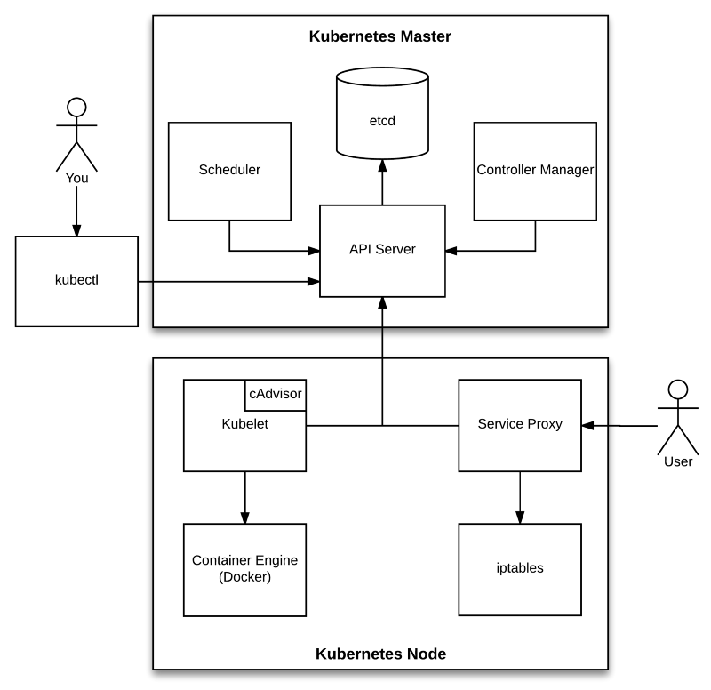

# Master components

- The Kubernetes master runs the Scheduler, Controller Manager, API Server and etcd components and is responsible for managing the Kubernetes cluster. Essentially, it’s the brain of the cluster!

## Etcd

- Etcd is a distributed, consistent key-value store used for configuration management, service discovery, and coordinating distributed work.

## API Server (kube-apiserver)

- Component on the master that exposes the Kubernetes API. It is the front-end for the Kubernetes control plane.

- When you interact with your Kubernetes cluster using the kubectl command-line interface, you are actually communicating with the master API Server component.

## Controller Manager (kube-controller-manager)

- The Kubernetes Controller Manager is a daemon that embeds the core control loops (also known as “controllers”) shipped with Kubernetes. Basically, a controller watches the state of the cluster through the API Server watch feature and, when it gets notified, it makes the necessary changes attempting to move the current state towards the desired state. Some examples of controllers that ship with Kubernetes include the Replication Controller, Endpoints Controller, and Namespace Controller.

- Besides, the Controller Manager performs lifecycle functions such as namespace creation and lifecycle, event garbage collection, terminated-pod garbage collection, cascading-deletion garbage collection, node garbage collection, etc.

## Scheduler (kube-schedule)

- Component on the master that watches newly created pods that have no node assigned, and selects a node for them to run on.

- Factors taken into account for scheduling decisions include individual and collective resource requirements, hardware/software/policy constraints, affinity and anti-affinity specifications, data locality, inter-workload interference and deadlines.

# Node components

- In Kubernetes, the nodes are the worker machines where your pods run.

## Kubelet

- An agent that runs on each node in the cluster. It makes sure that containers are running in a pod.

- The kubelet takes a set of PodSpecs that are provided through various mechanisms and ensures that the containers described in those PodSpecs are running and healthy. The kubelet doesn’t manage containers which were not created by Kubernetes.

## kuber-proxy

- kube-proxy enables the Kubernetes service abstraction by maintaining network rules on the host and performing connection forwarding.

## Container Runtime

- The container runtime is the software that is responsible for running containers. Kubernetes supports several runtimes: Docker, rkt, runc and any OCI runtime-spec implementation

# Addons

- Addons are pods and services that implement cluster features. The pods may be managed by Deployments, ReplicationControllers, and so on. Namespaced addon objects are created in the kube-system namespace

## DNS
## Web UI (Dashboard)
## Container Resource Monitorning
## Cluster-level Logging
